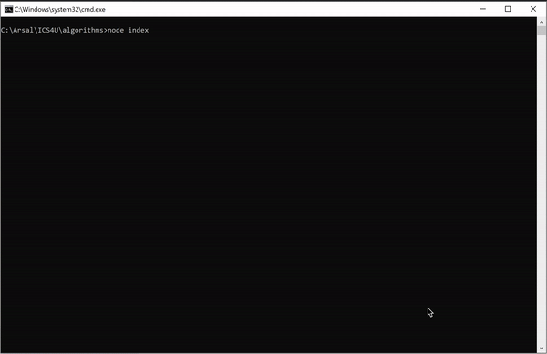
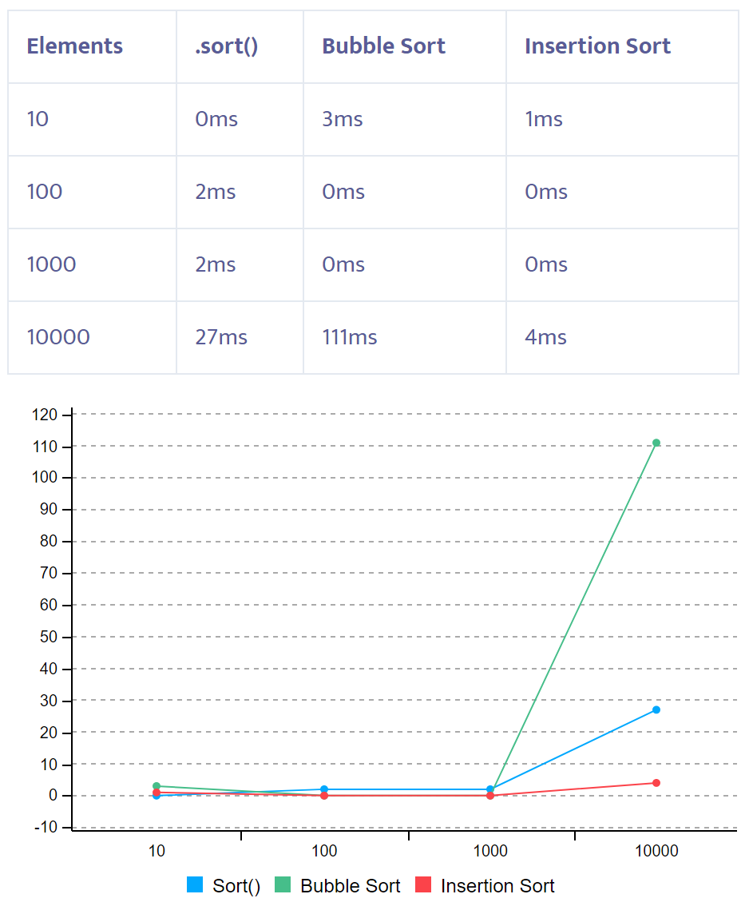
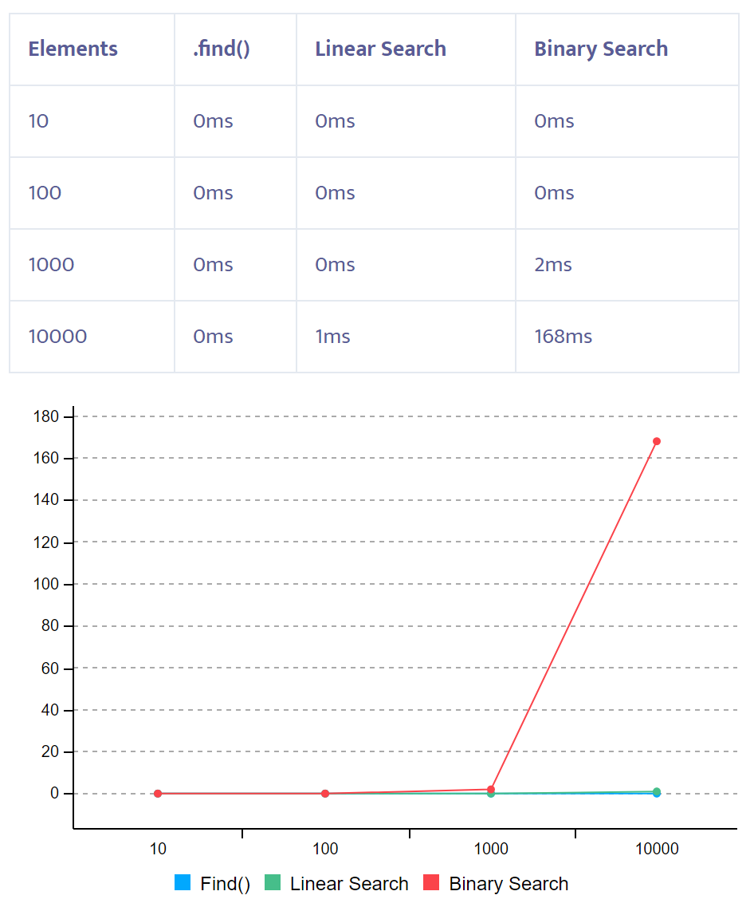

# Algorithms

The program implements object sorting via `Bubble` and `Insertion` sort algorithms. It  also searches for the objects within unsorted and sorted array using `linear` and `binary` searches. It also compares the results those you can see in [SortComparison](data/sortcomparison.png) and [Search Comparisons](data/searchcomparison.png)  

It also demostrate the use of recursive vs iterative uses via 2 pratical problems
1. If the user enters the integer number, will get the sum digits of the number.
2. The application generates the palindromes from the inputed words with iterative, 

  

## How to run

Execute following statements on command line at root project directory  

- `npm install`
- `npm link`
- `node index.js`  
- `Select Option from menu`  
	1. Bubble Sort   
	2. Insertion Sort   
	3. Comparison Sorts  
	4. Linear Search  
	5. Binary Search  
	6. Problem1  
	7. Problem2  

  

## Data Preparation 
1.	Created following object for this assignment  
``` json 
    Article { 
        id: int, 
        title: string, 
        score: int
    }
```
2.	Create 30 entries in a [data.json](data.json) 
3.	Create 10,000 entries in [bigdata.json](bigdata.json) 

##	Sort 

### Bubble Sort
The code is in [lib/sort/bubblesort.js](lib/sort/bubblesort.js)  
The bubblesort_demo() in [index.js](index.js) executes following steps

1.	Loads data from data.json  in an array of objects
2.  Prints the unsorted one on console
3.	Calls the Bubble Sort function and sort by score from ascending to descending
4.	Prints the sorted array

### Insertion Sort
The code is in [lib/sort/insertionsort.js](lib/sort/insertionsort.js)  
The insertionsort_demo() in [index.js](index.js) executes following steps

1.	Loads data from data.json  in an array of objects
2.  Prints the unsorted one on console
3.	Calls the Insertion Sort function and sort by score from ascending to descending
4.	Prints the sorted array

### Comparison of Bubble, Insertion and built-in sort

For the comparison, loaded [bigdata.json](bigdata.json) file using all three and recorded the time and observed that:
- Bubble Sort is slow regarless of number of items in array.
- Insertion sort is fastest on at least NodeJS platform.  
- Following is the visualization of above experiment   
- 

## Search

### Linear Search
The code is in [lib/search/linearsearch.js](lib/search/linearsearch.js)  
The linearsearch_demo() in [index.js](index.js) executes following steps:  

1.	Loads data from data.json in an array of objects
2.	Prints the unsorted one on console
3.	Calls the binary search function and display the position on console. -1 if not found.

### Binary Search
The code is in [lib/search/binarysearch.js](lib/search/binarysearch.js)  
The binarysearch_demo() in [index.js](index.js) executes following steps:  

1.	Loads data from data.json in an array of objects
2.  Sorts the data using Insertion sort function
3.	Prints the sorted array on console
4.	Calls the Binary search function and display the position on console. -1 if not found.

### Comparison of Linear, Binary and built-in searches

For the comparison, loaded [bigdata.json](bigdata.json) file using all three and recorded the time and observed that:
- Linear is slowest as it just goes in sequence 
- Binary is fast but keep in mind the cost of sorting before using this. It is still very fast
- The in-built one was fastest regardless of number size and tries. 
- Following is the visualization of above experiment   
- 


## Recusion

### Problem 1
The code is in [lib/rcusrsion/problem1_iterative.js](lib/rcusrsion/problem1_iterative.js) and in [lib/rcusrsion/problem1_recursive.js](lib/rcusrsion/problem1_recursive.js)

- The problem1_demo() in [index.js](index.js) takes the input from console and display the results using both iterative and recursive approach.
 
### Problem 2
The code is in [lib/rcusrsion/problem2_iterative.js](lib/rcusrsion/problem1_iterative.js) and in [lib/rcusrsion/problem2_recursive.js](lib/rcusrsion/problem1_recursive.js)

- The problem2_demo() in [index.js](index.js) takes the input from console and display the counts and number of combinations on console using both iterative and recursive approach.  
 
### Question and Answer
1. What are some common pitfalls of recursion?   
    Simplye it's infinite cycle. If there are no appropriate return statement, the recursion function will be fall in infinite cycle.  
    
    Recursion, broadly speaking, has the following disadvantages:  
    -A recursive program has greater space requirements than an iterative program 
    as each function call will remain in the stack until the base case is reached.  
    -It also has greater time requirements because each time the function is called, 
    the stack grows and the final answer is returned when the stack is popped completely.  
  
    On the other hand, recursion has the following advantages  
    -For a recursive function, you only need to define the base case and recursive case, 
    so the code is simpler and shorter than an iterative code.  
    -Some problems are inherently recursive, such as Graph and Tree Traversal.  

2. What issues did you run into during your development of the below algorithms?  
    -should be careful not to fall into infinite cycle, so I made the below if statements in the recursion function  
        if (n == 0)  
            return 0;
 
## Citation and Credits

1. Leveraged [John Kotis](https://github.com/johnkottis)' work on [nodejs-console-app](https://github.com/johnkottis/nodejs-console-app) to build command line menu options and to read json files.
2. Leveraged ParseTime function from [here](https://npmdoc.github.io/node-npmdoc-tcp-ping/build/apidoc.html)
